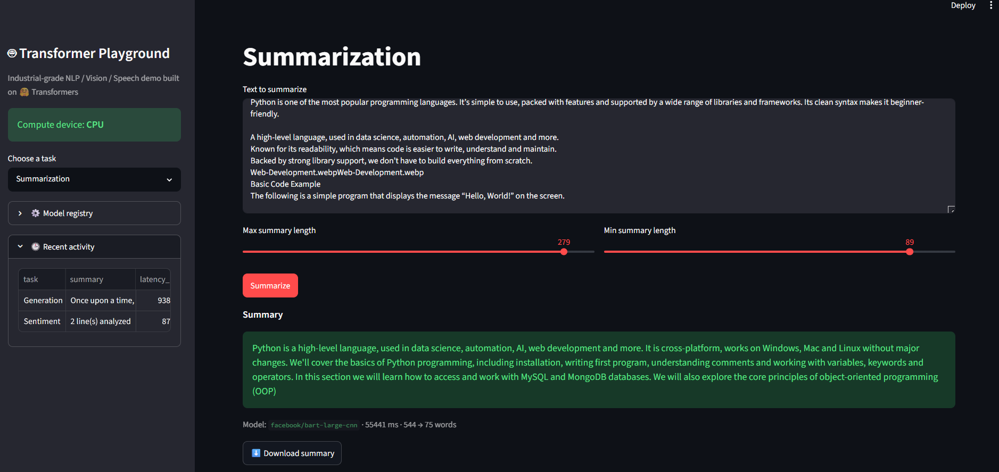
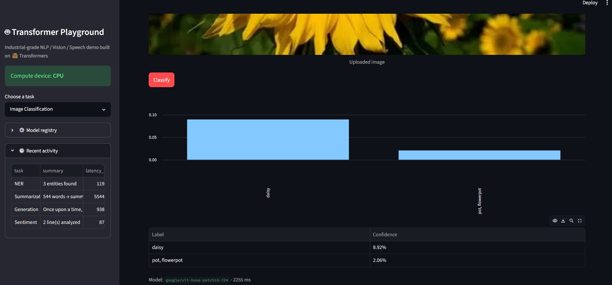

# 🤖 Transformer Playground


An industrial-grade Streamlit application exposing seven Hugging Face
Transformers tasks - text, vision, and speech - through a single, well
structured web UI. Models load lazily and are cached, every input is
validated, and every model error is caught and shown as a clean message
instead of a raw traceback.

---

## Table of contents

- [Features](#features)
- [Screenshots](#screenshots)
- [Project structure](#project-structure)
- [Setup](#setup)
- [Running with Docker](#running-with-docker)
- [Configuration reference](#configuration-reference)
- [Testing](#testing)
- [Logging & observability](#logging--observability)
- [Known limitations](#known-limitations)
- [Author](#author)
- [License](#license)

---

## Features

| Task | What it does |
|---|---|
| 🙂 **Sentiment Analysis** | Batch-scores one or more lines of text as positive/negative with confidence |
| ✍️ **Text Generation** | Free-form generation with adjustable temperature, top-p, length, and sequence count |
| 📝 **Summarization** | Condenses long text into a configurable-length summary |
| 🏷️ **Named Entity Recognition** | Extracts people, places, organizations, etc. from text |
| 🖼️ **Image Classification** | Top-K label predictions for an uploaded image, with a confidence chart |
| 🔍 **Zero-Shot Image Classification (CLIP)** | Classifies an image against *any* labels you type in — no fixed label set |
| 🎙️ **Automatic Speech Recognition** | Transcribes uploaded audio (mp3/wav/flac/m4a) to text |

Plus, under the hood:

- **Lazy, cached model loading** - each model loads only the first time its task is used, then stays cached for the life of the server process.
- **Input validation** - empty text, oversized images/audio, and corrupt files are rejected with a friendly warning before any model runs.
- **Robust error handling** - failures are logged with full tracebacks for you, while the UI only ever shows a clean, sanitized message.
- **Environment-variable configuration** - swap any of the 7 models or 4 limits without touching code.
- **Per-result downloads** (JSON/text), a recent-activity log, and live CPU/GPU device status in the sidebar.
- **Unit tested** — `pytest` coverage for all input validation, no model downloads required to run the suite.
- **Container-ready** — `Dockerfile` includes the system `ffmpeg` dependency the ASR pipeline needs.

---

## Screenshots

<table>
<tr>
<td align="center"><b>Sentiment Analysis</b><br/></td>
<td align="center"><b>Text Generation</b><br/></td>
</tr>
<tr>
<td align="center"><b>Summarization</b><br/></td>
<td align="center"><b>Named Entity Recognition</b><br/></td>
</tr>
<tr>
<td align="center"><b>Image Classification</b><br/></td>
<td align="center"><b>Zero-Shot Classification (CLIP)</b><br/></td>
</tr>
</table>

---

## Project structure

```
transformer-playground/
├── app.py                 # Streamlit UI — presentation only
├── core/
│   ├── __init__.py
│   ├── config.py          # Settings, model registry, logging setup
│   ├── engine.py          # Lazy cached model loaders + inference functions
│   └── utils.py           # Pure validation/formatting helpers (no ML deps)
├── tests/
│   └── test_utils.py      # Unit tests for core.utils
├── screenshots/           # Images used in this README
├── requirements.txt
├── Dockerfile
├── .env.example
├── .gitignore
└── README.md
```

`core/utils.py` has zero dependency on Streamlit, PyTorch, or Transformers,
so its validation logic is fully unit testable in milliseconds. `core/engine.py`
owns every model and every inference call, so `app.py` never touches a model
directly — it only calls `engine.run_*()` and renders the result.

---

## Setup

### 1. Clone the repo and create a virtual environment

```bash
git clone <your-repo-url>
cd transformer-playground
python3 -m venv aienv
source aienv/bin/activate   # Windows: aienv\Scripts\activate
```

> Use whatever environment name and tool you prefer (`venv`, `conda`,
> `virtualenv`) — just make sure it's listed in `.gitignore` before pushing.

### 2. Install dependencies

```bash
pip install -r requirements.txt
```

### 3. Install `ffmpeg` (required for Automatic Speech Recognition)

The Transformers ASR pipeline shells out to the `ffmpeg` binary to decode
uploaded `mp3`/`m4a`/`flac` files into raw audio — this is a **system**
dependency, not a Python package.

```bash
# Debian/Ubuntu
sudo apt-get install ffmpeg

# macOS
brew install ffmpeg

# Windows (winget)
winget install ffmpeg
```

This step only matters for the ASR task — every other task works without it.

### 4. (Optional) configure models and limits

```bash
cp .env.example .env
# edit .env, then export it before running, e.g.:
export $(grep -v '^#' .env | xargs)
```

All settings have working defaults — this step is optional.

### 5. Run

```bash
streamlit run app.py
```

The app opens at `http://localhost:8501`. The first time you use each task,
its model downloads from the Hugging Face Hub (cached locally by
`transformers` afterward).

---

## Running with Docker

```bash
docker build -t transformer-playground .
docker run -p 8501:8501 transformer-playground
```

To override models or limits at runtime:

```bash
docker run -p 8501:8501 \
  -e SUMMARIZATION_MODEL=sshleifer/distilbart-cnn-12-6 \
  -e MAX_TEXT_CHARS=3000 \
  transformer-playground
```

> **GPU note:** the base image is CPU-only. For GPU inference, switch to an
> `nvidia/cuda`-based image with a matching PyTorch build and run the
> container with `--gpus all`.

---

## Configuration reference

All settings are environment variables with sensible defaults — see
`.env.example`. None are required to run the app out of the box.

| Variable | Default | Purpose |
|---|---|---|
| `SENTIMENT_MODEL` | `distilbert-base-uncased-finetuned-sst-2-english` | Sentiment Analysis model |
| `GENERATION_MODEL` | `gpt2` | Text Generation model |
| `SUMMARIZATION_MODEL` | `facebook/bart-large-cnn` | Summarization model (~1.6 GB — see note below) |
| `NER_MODEL` | `dslim/bert-base-NER` | Named Entity Recognition model |
| `IMAGE_CLASSIFICATION_MODEL` | `google/vit-base-patch16-224` | Image Classification model |
| `CLIP_MODEL` | `openai/clip-vit-base-patch32` | Zero-shot image/text matching model |
| `ASR_MODEL` | `openai/whisper-small` | Speech-to-text model |
| `MAX_TEXT_CHARS` | `5000` | Max characters per text input |
| `MAX_IMAGE_MB` | `10` | Max uploaded image size |
| `MAX_AUDIO_MB` | `25` | Max uploaded audio size |
| `MAX_BATCH_LINES` | `50` | Max lines in a batch sentiment request |
| `LOG_LEVEL` | `INFO` | Python logging level |

**Running on limited memory/CPU?** Swap in lighter models, e.g.:

```bash
export SUMMARIZATION_MODEL=sshleifer/distilbart-cnn-12-6
export ASR_MODEL=openai/whisper-tiny
```

**Summarizing long documents?** `facebook/bart-large-cnn` caps input at
1024 tokens; longer text is safely truncated and the app will tell you when
that happens. For very long documents, split the text into chunks and
summarize each one separately.

---

## Testing

```bash
pytest tests/ -v
```

The test suite covers all input validation in `core/utils.py` and runs
without loading any ML model — no GPU, no network, no multi-second model
downloads.

---

## Logging & observability

All model loads and inference calls are logged via the standard `logging`
module (`core/config.py` configures format and level). Every caught
inference error is logged with its full traceback before a sanitized
message is shown to the user — so you can debug from logs without ever
exposing internals in the UI.

---

## Known limitations

- `gpt2` and `distilbert-...-sst-2-english` are small, fast, English-only
  models chosen for responsiveness; swap in larger/multilingual models via
  the environment variables above as needed.
- The app is single-process; for multi-user production traffic behind real
  load, run multiple replicas behind a load balancer.
- No authentication layer is included — add one (e.g. via a reverse proxy
  or `streamlit-authenticator`) before exposing this publicly.

---

## Author

**Mallareddygari Gayathri**

GitHub: [@Gayathri-Reddy874](https://github.com/Gayathri-Reddy874)

---

## License

This project is licensed under the [MIT License](LICENSE).
